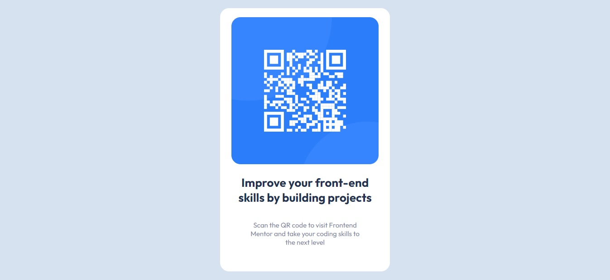

# Frontend Mentor - QR code component solution

This is a solution to the [QR code component challenge on Frontend Mentor](https://www.frontendmentor.io/challenges/qr-code-component-iux_sIO_H). Frontend Mentor challenges help you improve your coding skills by building realistic projects.

## Table of contents

- [Overview](#overview)
  - [Screenshot](#screenshot)
  - [Links](#links)
- [My process](#my-process)
  - [Built with](#built-with)
  - [What I learned](#what-i-learned)
  - [Continued development](#continued-development)
  - [Useful resources](#useful-resources)
- [Author](#author)
- [Acknowledgments](#acknowledgments)

## Overview

This is my very first HTML, CSS project. I found it on frontendmentor.io. I have gone through the responsive web design course on https://www.freecodecamp.org/ as well as a tutorial provided by https://www.internetingishard.com/. I decided to put my knowledge to the test and develop my skills through application. It was very challenging but it allowed me to more understand what I have learned so far. I had a lot of fun on this project even though I had to walk away sometimes.

### Screenshot

### Links

- Solution URL: [https://dominic1288.github.io/qr-code-project/]
## My process

### Built with

- HTML5
- CSS3

### What I learned

In building this project my key takaway was in understanding the CSS box model and working with content, padding, border, margin and how they interact.

### Continued development

I still need much much more education and development in HTML and CSS but this is a very good start for me.

### Useful resources

- [Free Code Camp](https://www.freecodecamp.org/) - This helped me really get started coding and understand what exactly I was getting myself into. A great resource people brand new to the field.

- [Interneting is Hard](https://www.internetingishard.com/) - Interneting is hard has 14 chapters and 284 examples to code along with. This gave me some experience working in the code editor.

- YouTube University - YouTube is an excellent resource for anything and everything you need to learn. On this project I used it to understand and get started with Git and GitHub as well as to learn how to deploy my project on GitHub Pages.

## Author

- Frontend Mentor - [@Dominic1288](https://www.frontendmentor.io/profile/Dominic1288)
- Twitter - [@DominicQStoner](https://twitter.com/DominicQStoner)

## Acknowledgments

Shout out to my mentor Justin Schneider (Twitter: @justinmakescode) for all his help and guidance. He always picked up the phone or responded to my text when I needed it. One particular time we jumped on a video call so he could see why my code wasn't working and we discovered that I had spelled style wrong in my style element on my HTML markup!